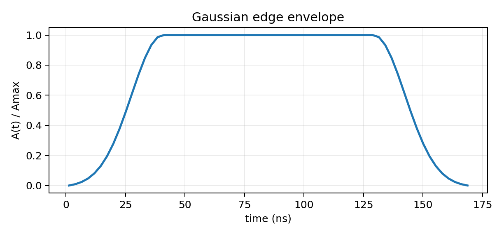
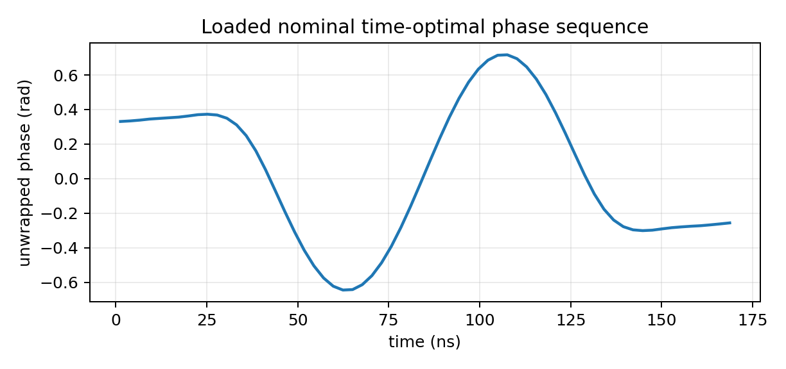
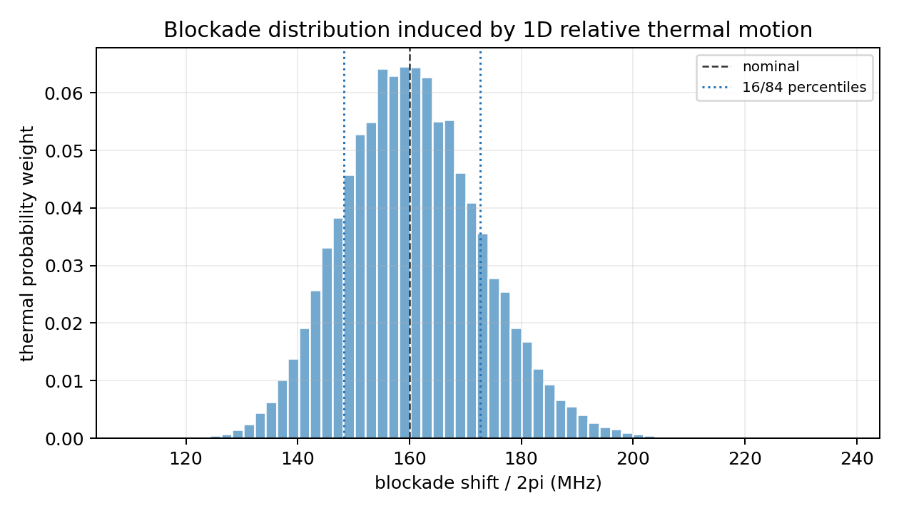
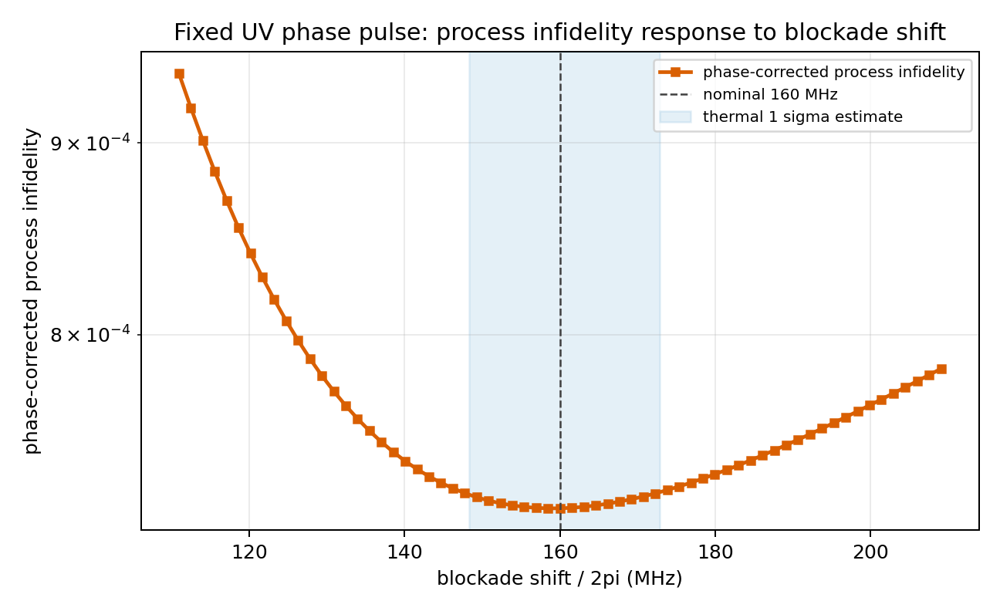
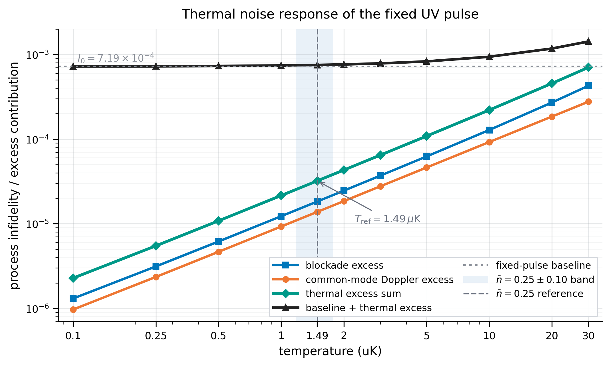

# `^{171}Yb` UV Rydberg CZ 片段的热涨落响应

本文整理固定 `^{171}Yb` UV Rydberg controlled-Z (CZ) 控制片段在有限温度下的热噪声响应。该片段是 shelved control-Rydberg excitation stage，不是完整实验门序列。目标是隔离热运动进入有效 Hamiltonian 的主要通道：相对位置涨落诱导的 blockade shift 分布，以及沿 UV 波矢方向速度涨落诱导的 common-mode Doppler detuning。

固定 pulse 是在只考虑 Rydberg decay 的 no-jump 模型中按 time-optimal 思路得到的 Gaussian-edge phase-only pulse，没有针对热噪声重新优化。

## 1. 问题设定

thermal response 可以写成：

\[
\text{thermal motion}
\longrightarrow
\{q,\delta_1,\delta_2\}
\longrightarrow
H(t;q,\delta_1,\delta_2)
\longrightarrow
U_\mathrm{no\ jump}
\longrightarrow
F_\mathrm{pro}.
\]

其中 `q` 是两原子沿连线方向的相对位移，`\delta_i` 是第 `i` 个原子的 Doppler detuning。相对位移改变 Rydberg pair interaction `B(R)`，速度涨落改变 UV excitation 的有效失谐。温度换算、blockade fluctuation 尺度、fidelity 定义和采样细节分别见 [附录 A](#附录-a温度参数化与-nbar-到-t-的对应)、[附录 B](#附录-bblockade-fluctuation-尺度推导)、[附录 C](#附录-cfidelity-定义与-virtual-z-phase-correction)、[附录 D](#附录-d数值采样与-temperature-scan-表)。

## 2. 有效模型与固定 pulse

### 2.1 Reduced basis

每个原子的相关态粗略记为

\[
|0\rangle,\qquad |c\rangle,\qquad |r\rangle.
\]

数值模型采用交换对称 reduced basis：

```text
|00>, |0c>, |0r>, |cc>, |W_cr>, |rr>
```

其中

\[
|W_{cr}\rangle=\frac{|cr\rangle+|rc\rangle}{\sqrt{2}}.
\]

理想 CZ 条件是 pulse 结束后 diagonal branches 回到自身，只积累相位，并满足

\[
\theta_{cc}-2\theta_{0c}+\theta_{00}=\pi\quad (\mathrm{mod}\ 2\pi).
\]

### 2.2 Pulse 形状：time-optimal phase-only control

UV laser 的复 Rabi frequency 写成

\[
\Omega(t)=\Omega_\mathrm{max}A(t)e^{i\phi(t)}.
\]

当前使用的 pulse 参数为

\[
\Omega_\mathrm{max}/2\pi=10\,\mathrm{MHz},\qquad
T_\mathrm{gate}=170\,\mathrm{ns},\qquad
N_t=64.
\]

`A(t)` 是固定 Gaussian-edge envelope，edge time 为 `40 ns`；`\phi(t)` 是 64-slot phase sequence。这个 pulse 来自只考虑 Rydberg decay 的 no-jump 模型下的 time-optimal phase-only 优化：固定最大 Rabi 频率和 Gaussian edge 后，寻找最短且达到 fidelity threshold 的相位波形。





### 2.3 Hamiltonian 与 no-jump decay

在 rotating frame 中，控制项可写成

\[
H_\mathrm{ctrl}(t)=
\frac{\Omega_\mathrm{max}A(t)}{2}
\left[e^{i\phi(t)}|0r\rangle\langle0c|+\mathrm{h.c.}\right]
+
\frac{\Omega_\mathrm{max}A(t)}{\sqrt{2}}
\left[e^{i\phi(t)}|W_{cr}\rangle\langle cc|
+e^{i\phi(t)}|rr\rangle\langle W_{cr}|+\mathrm{h.c.}\right].
\]

有限 blockade 和 common-mode Rydberg detuning 分别进入 diagonal drift：

\[
H_B=B(R)|rr\rangle\langle rr|,
\]

\[
H_\delta=\delta |0r\rangle\langle0r|+\delta |W_{cr}\rangle\langle W_{cr}|+2\delta |rr\rangle\langle rr|.
\]

Rydberg decay 通过 no-jump 非厄米项加入：

\[
G_\mathrm{decay}
=-\frac12\mathrm{diag}(0,0,\gamma,0,\gamma,2\gamma)/\Omega_\mathrm{max}.
\]

### 2.4 Fidelity 读数

静态 blockade scan 中允许重新拟合 virtual-`Z` phases `\alpha,\beta`，计算 phase-corrected restricted CZ process fidelity：

\[
F_\mathrm{pro}
=\frac{1}{16}\left|
z_{00}e^{-i\alpha}
+2z_{0c}e^{-i(\alpha+\beta)}
-z_{cc}e^{-i(\alpha+2\beta)}
\right|^2.
\]

温度扫描中 thermal shifts 是 shot-to-shot random，因此使用固定 nominal virtual-`Z` phases，并报告 baseline-subtracted excess infidelity。标称点的 baseline 为

\[
I_0=1-F_0=7.1897674\times10^{-4}.
\]

完整的 process fidelity、active population、no-jump average fidelity 和 fixed virtual-`Z` averaging 定义见 [附录 C](#附录-cfidelity-定义与-virtual-z-phase-correction)。

## 3. 热运动噪声模型与 fidelity 响应

### 3.1 位置涨落 `->` blockade 分布 `->` fidelity 响应

两原子标称间距为 `R_0=3 um`。若相对热位移为 `q`，则

\[
R=R_0+q,
\qquad
B(R)=B_0\left(\frac{R_0}{R}\right)^6
=\frac{B_0}{(1+q/R_0)^6}.
\]

线性化给出 `\Delta B/B_0\simeq -6q/R_0`，完整推导见 [附录 B](#附录-bblockade-fluctuation-尺度推导)。参考温度下，`q` 的一维 Gaussian 分布通过上式映射成下图的 blockade distribution。



参考温度下该分布的 mean 为 `160.550 MHz`，standard deviation 为 `12.346 MHz`，16/84 分位点为 `148.257/172.675 MHz`。在这个分布上平均 phase-corrected process fidelity 得到

\[
F_\mathrm{pro}^{(B\ \mathrm{avg})}=0.999274365878,
\]

即 process infidelity 从标称 `7.1898e-4` 变为 `7.2563e-4`。

为了把该分布转换成 fidelity 影响，还需要固定 pulse 的 response function：

\[
B\longmapsto 1-F_\mathrm{pro}(B).
\]



图中 `B/h=160 MHz` 附近曲线较平，因此参考温度下的 blockade fluctuation 只带来 `10^{-5}` 量级额外 infidelity；但如果 blockade 明显降低到 `120 MHz` 附近，infidelity 会快速上升。

### 3.2 Doppler 噪声 `->` common-mode detuning `->` fidelity 响应

一维 thermal velocity distribution 给出

\[
\sigma_v^2(T)=\frac{k_B T}{m}.
\]

对单光子 UV excitation，`k_UV=2pi/lambda`，`lambda=301.9 nm`，所以单原子 Doppler RMS 为

\[
\frac{\sigma_\delta(T)}{2\pi}=\frac{\sigma_v(T)}{\lambda}
=23.097\sqrt{T_{\mu\mathrm{K}}}\,\mathrm{kHz}.
\]

参考温度下

\[
\frac{\sigma_\delta}{2\pi}=28.20\,\mathrm{kHz},
\qquad
\frac{\sigma_\delta}{\Omega}=2.82\times10^{-3}.
\]

定义

\[
\delta_c=\frac{\delta_1+\delta_2}{2},
\qquad
\delta_d=\frac{\delta_1-\delta_2}{2}.
\]

当前六态模型只包含 `|W>`，没有 `|A>`，因此只纳入 common-mode `\delta_c`。参考温度下得到 common-mode Doppler excess infidelity

\[
\Delta I_D(T_\mathrm{ref})=1.38\times10^{-5}.
\]

这个数值与 blockade contribution `\Delta I_B(T_ref)=1.83e-5` 同量级但略小。它不是完整 Doppler error，因为差分 detuning 对 antisymmetric sector 的耦合尚未进入模型。

### 3.3 整体 thermal temperature scan components

定义 baseline-subtracted contributions：

\[
\Delta I_B(T)=\langle 1-F_B(q)\rangle_q-I_0,
\qquad
\Delta I_D(T)=\langle 1-F_D(\delta_c)\rangle_{\delta_c}-I_0.
\]

总 thermal excess 与估计总 infidelity 为

\[
\Delta I_\mathrm{thermal}(T)=\Delta I_B(T)+\Delta I_D(T),
\qquad
I_\mathrm{total}(T)=I_0+\Delta I_\mathrm{thermal}(T).
\]

更完整的 fidelity 定义见 [附录 C](#附录-cfidelity-定义与-virtual-z-phase-correction)；采样和插值细节见 [附录 D](#附录-d数值采样与-temperature-scan-表)。



这张图使用 log-log 坐标。蓝色、橙色、绿色分别是 blockade excess、common-mode Doppler excess 和二者相加；黑色是 baseline 加 thermal excess。淡蓝色背景标出 `nbar=0.25±0.10` 对应的温度区间，灰色竖线是 `nbar=0.25` 的参考温度。

在 `T_ref ~= 1.49 uK` 附近，thermal excess sum 为 `3.21e-5`，显著低于 fixed-pulse baseline `I_0 ~= 7.19e-4`。升温到 `30 uK` 时，thermal excess 增至 `7.04e-4`，与 baseline 同量级；此时热运动不再是小修正。logarithmic 横轴也更清楚地显示了低温区的近似幂律增长。

## 4. 物理解读

第一，在参考冷却条件附近，固定 UV pulse 的主要 infidelity 仍来自 fixed-pulse baseline，包括 Rydberg decay、有限 Gaussian edge 和 finite-blockade dynamics；thermal blockade 与 common-mode Doppler 只是小的附加项。

第二，blockade distribution 与 response curve 必须一起读。distribution 告诉我们热运动让 `B` 取哪些值，response curve 告诉我们每个 `B` 对 fidelity 的代价，二者平均才给出位置热涨落对门 fidelity 的影响。

第三，Doppler 部分当前只是 common-mode first-pass estimate。若要用于完整误差预算，需要加入 antisymmetric `|A>` sector，并把 blockade 与 Doppler 在同一 Monte Carlo trajectory 中联合采样。

## 附录 A：温度参数化与 `nbar` 到 `T` 的对应

\[
\bar n(T)=\frac{1}{\exp(\hbar\omega_t/k_B T)-1},
\qquad
T(\bar n)=\frac{\hbar\omega_t}{k_B\ln(1+1/\bar n)}.
\]

本模型使用 `omega_t=2pi*50 kHz`，所以

\[
\frac{\hbar\omega_t}{k_B}=2.399622\,\mu\mathrm{K}.
\]

`nbar=0.25` 对应

\[
T_\mathrm{ref}=1.490969\,\mu\mathrm{K}.
\]

## 附录 B：Blockade fluctuation 尺度推导

单个原子的热空间 RMS 为

\[
\sigma_x^2(T)=\frac{k_B T}{m\omega_t^2}.
\]

两原子的相对位移 RMS 是

\[
\sigma_q(T)=\sqrt{2}\sigma_x(T).
\]

展开 van der Waals law：

\[
\frac{B(R)}{B_0}=\left(1+\frac{q}{R_0}\right)^{-6}
\simeq 1-6\frac{q}{R_0}+21\left(\frac{q}{R_0}\right)^2+O(q^3/R_0^3).
\]

leading RMS blockade fluctuation 为

\[
\boxed{\frac{\sigma_B(T)}{h}=10.045\sqrt{T_{\mu\mathrm{K}}}\,\mathrm{MHz}}.
\]

在参考温度下，`sigma_x=27.10 nm`，`sigma_q=38.33 nm`，`sigma_B/h=12.27 MHz`。

## 附录 C：Fidelity 定义与 virtual-Z phase correction

固定 pulse 和给定噪声参数 `B,\delta` 后，no-jump propagator 在三个 diagonal branches 上给出

\[
z=\{z_{00},z_{0c},z_{cc}\}.
\]

这里 `z_{0c}` 代表 `|0c>` 与 `|c0>` 两个等价 branch，因此 restricted process overlap 中的权重为

\[
w=\{1,2,1\}.
\]

外部 virtual-`Z` phases 记为 `\alpha,\beta`。在当前 convention 下，restricted CZ process fidelity 为

\[
F_\mathrm{pro}(\alpha,\beta;B,\delta)
=\frac{1}{16}\left|
z_{00}e^{-i\alpha}
+2z_{0c}e^{-i(\alpha+\beta)}
-z_{cc}e^{-i(\alpha+2\beta)}
\right|^2.
\]

同一 no-jump propagator 的 active population 为

\[
P_\mathrm{act}(B,\delta)
=\frac{1}{4}\left(
|z_{00}|^2+2|z_{0c}|^2+|z_{cc}|^2
\right),
\]

对应的 no-jump average fidelity diagnostic 写成

\[
F_\mathrm{avg}^\mathrm{nj}
=\frac{4F_\mathrm{pro}+P_\mathrm{act}}{5}.
\]

静态 blockade response 图使用 phase-corrected process fidelity：

\[
F_\mathrm{pro}^\mathrm{pc}(B,\delta)
=\max_{\alpha,\beta}F_\mathrm{pro}(\alpha,\beta;B,\delta).
\]

这个读数回答的问题是：如果 blockade shift 改变后仍允许重新吸收 single-qubit `Z` phases，剩余的 process infidelity 是多少。

temperature scan 使用 fixed nominal virtual-`Z` phases。设 `\alpha_0,\beta_0` 是标称点 `B=B_0,\delta=0` 的 phases，则

\[
F_\mathrm{pro}^\mathrm{fix}(B,\delta)
=F_\mathrm{pro}(\alpha_0,\beta_0;B,\delta).
\]

随机热噪声 shot-to-shot 不可知，因此不能对每个 sample 重新拟合 `\alpha,\beta`。这就是 temperature scan 中使用 fixed-phase averaging 的原因。

位置噪声与 common-mode Doppler 噪声分别给出

\[
\langle I_B(T)\rangle
=\left\langle 1-F_\mathrm{pro}^\mathrm{fix}(B(q),0)\right\rangle_q,
\qquad
\langle I_D(T)\rangle
=\left\langle 1-F_\mathrm{pro}^\mathrm{fix}(B_0,\delta_c)\right\rangle_{\delta_c}.
\]

为避免重复计入标称 pulse 的 decay-plus-envelope baseline，正文报告的是

\[
\Delta I_B(T)=\langle I_B(T)\rangle-I_0,\qquad
\Delta I_D(T)=\langle I_D(T)\rangle-I_0,
\]

其中

\[
I_0=1-F_\mathrm{pro}^\mathrm{fix}(B_0,0).
\]

## 附录 D：数值采样与 temperature scan 表

temperature scan 使用 4096 个 Gaussian samples，seed 为 `17120260603`。blockade 和 Doppler contributions 分开平均后再一阶相加；这避免了直接相加 noisy infidelity 时重复计入 fixed-pulse baseline。

| `T` (uK) | `sigma_q` (nm) | `sigma_B/h` (MHz) | common Doppler RMS (kHz) | `Delta I_B` | `Delta I_D` | `I_total` |
| ---: | ---: | ---: | ---: | ---: | ---: | ---: |
| `0.10` | `9.926` | `3.176` | `5.165` | `1.308e-06` | `9.701e-07` | `7.2125e-04` |
| `0.25` | `15.695` | `5.022` | `8.166` | `3.131e-06` | `2.354e-06` | `7.2446e-04` |
| `0.50` | `22.196` | `7.103` | `11.549` | `6.169e-06` | `4.659e-06` | `7.2980e-04` |
| `1.00` | `31.389` | `10.045` | `16.332` | `1.227e-05` | `9.272e-06` | `7.4052e-04` |
| `1.491` | `38.328` | `12.265` | `19.942` | `1.830e-05` | `1.380e-05` | `7.5108e-04` |
| `2.00` | `44.391` | `14.205` | `23.097` | `2.458e-05` | `1.849e-05` | `7.6205e-04` |
| `3.00` | `54.368` | `17.398` | `28.288` | `3.704e-05` | `2.772e-05` | `7.8373e-04` |
| `5.00` | `70.189` | `22.460` | `36.520` | `6.236e-05` | `4.616e-05` | `8.2749e-04` |
| `10.00` | `99.262` | `31.764` | `51.647` | `1.281e-04` | `9.226e-05` | `9.3929e-04` |
| `20.00` | `140.378` | `44.921` | `73.039` | `2.703e-04` | `1.844e-04` | `1.1737e-03` |
| `30.00` | `171.927` | `55.017` | `89.454` | `4.270e-04` | `2.766e-04` | `1.4225e-03` |

## 附录 E：实验参数与范围说明

主要参数来自 Muniz et al., PRX Quantum 6, 020334 (2025)：UV wavelength `301.9 nm`，Rydberg state `|65 ^3S_1,F=3/2,m_F=-3/2>`，pair spacing `3 um`，science trap frequency `50 kHz`，cooling result `nbar=0.25(10)`，blockade interaction `U/h=160 MHz`，Rydberg lifetime `65(3) us`。Doppler scale 使用 Li, Qian, and Zhang, NJP 27, 054502 (2025) 的 quasistatic Doppler model。本文不包括 UV phase noise、laser intensity noise、clock errors、readout model、branch-resolved decay 或 Förster-resonance pair spectrum。
